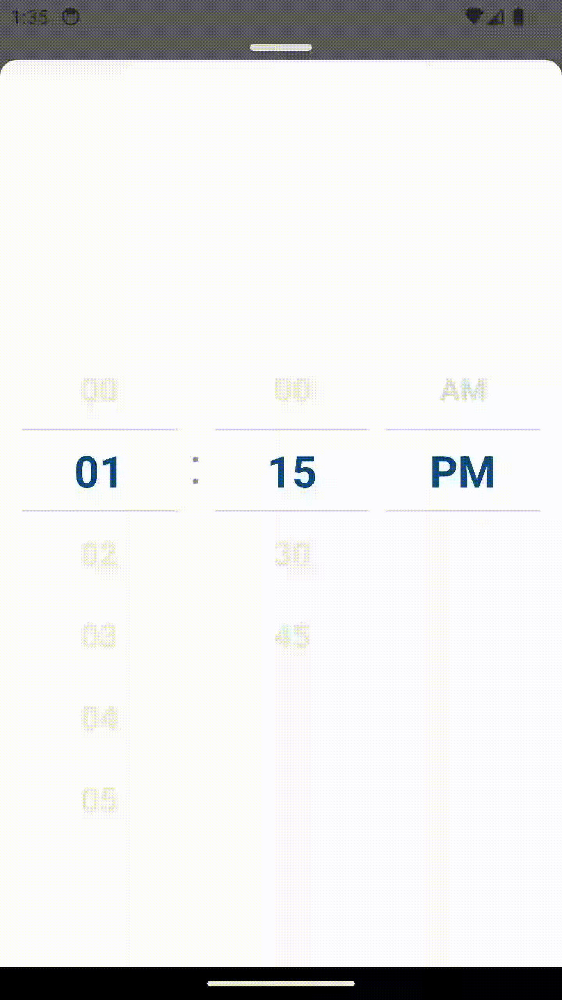

<!-- [](https://github.com/hoaphantn7604/file-upload/blob/master/document/dropdown/react-native-limit-timepicker-demo.png) -->

# react-native-limit-timepicker
[](https://www.npmjs.com/package/react-native-limit-timepicker)
[](https://opensource.org/licenses/MIT)
React Native Limit Timepicker is a library that provides a LIMITABLE and CUSTOMIZABLE timepicker component for React Native applications.

 <p align="center">
   
</p>

## Features
* Dropdown and Multiselect in one package
* Smooth Animated Timepicker
* Can limit the minimum time and maximum time
* Easy to use
* Consistent look and feel on iOS and Android
* Customizable font size, colors and animation duration
* Implemented with typescript

```js
If you love this library, give us a star, you will be a ray of sunshine in our lives :)
```

## Getting started
```js
npm install react-native-limit-timepicker --save
```
or

```js
yarn add react-native-limit-timepicker
```
<!-- ### Demo

[](https://youtu.be/FhTDR_Ad_14) -->

<br />

<!-- 
 -->

### Timepicker Props
| Props                | Params                  | isRequire                         | Description                                                                  |
| -------------------- | ----------------------- | --------------------------------- | ---------------------------------------------------------------------------- |
| disabled             | boolean                 | No                                | Disable the scrollable of Timepicker                                         |
| customHourData       | Array<ItemT = string    | number>                           | No                                                                           | String or number array of the hour (Ex:  [0, 1, 2, 3, 4, 5, 6, 7, 8, 9, 10, 11])                       |
| customMinutesData    | Array<ItemT>            | No                                | String or number array of the minute (Ex:  [0, 30])                          |
| customPeriodData     | Array<ItemT>            | Yes                               | String or number array of the minute (Ex:  ['am, 'pm'])                      |
| renderTextHour       | (data: ItemT) => string | No                                | Customize the text of the hour item                                          |
| renderTextMinute     | (data: ItemT) => string | No                                | Customize the text of the minute item                                        |
| renderTextPeriod     | (data: ItemT) => string | No                                | Customize the text of the period item                                        |
| onChangeHour         | (value: ItemT           | undefined, index: number) => void | No                                                                           | Called when the hour's momentum scroll ends (scroll which occurs as the ScrollView glides to a stop)   |
| onChangeMinute       | (value: ItemT           | undefined, index: number) => void | No                                                                           | Called when the minute's momentum scroll ends (scroll which occurs as the ScrollView glides to a stop) |
| onChangePeriod       | (value: ItemT           | undefined, index: number) => void | No                                                                           | Called when the period's momentum scroll ends (scroll which occurs as the ScrollView glides to a stop) |
| time                 | Date                    | No                                | Set default time                                                             |
| minDate              | Date                    | No                                | the minimum date can selected                                                |
| maxDate              | Date                    | No                                | the maximum date can selected                                                |
| containerStyle       | ViewStyle               | No                                | Styling for view container                                                   |
| scrollHourStyle      | ViewStyle               | No                                | Styling for hour scroll View                                                 |
| scrollMinuteStyle    | ViewStyle               | No                                | Styling for minute scroll View                                               |
| scrollPeriodStyle    | ViewStyle               | No                                | Styling for period scroll View                                               |
| highlightColor       | String                  | No                                | Border color for top and bottom centered item in scroll timepicker container |
| highlightBorderWidth | Number                  | No                                | Border width for top and bottom line selected in scroll timepicker container |
| hourTextStyle        | TextStyle               | No                                | Styling for hour text                                                        |
| minuteTextStyle      | TextStyle               | No                                | Styling for minute text                                                      |
| periodTextStyle      | TextStyle               | No                                | Styling for period text                                                      |
| activeItemTextStyle  | TextStyle               | No                                | Styling for selected text                                                    |
| itemHeight           | Number                  | No                                | Customize item height in each scroll container                               |
| wrapperHeight        | Number                  | No                                | Customize wrapper height of scroll container                                 |
| wrapperBackground    | String                  | No                                | Customize background color of scroll container                               |


### Timepicker example
<!--  -->
```js
  import React, { useState } from 'react';
  import { View } from 'react-native';
  import TimePicker from 'react-native-limit-timepicker';

  const TimePickerComponent = () => {
    return (
      <View style={styles.container}>
        <TimePicker
          customMinutesData={[0, 15, 30, 45]}
          onChangeHour={value => console.log('hour: ', value)}
          onChangeMinute={value => console.log('minute: ', value)}
          onChangePeriod={value => console.log('period: ', value)}
          minDate={new Date()}
          time={new Date()}
        />
      </View>
    );
  };

  export default TimePickerComponent;

  const styles = StyleSheet.create({
    container: {
      backgroundColor: 'white',
      padding: 16,
    },
  });
```

<br/>

<!-- [](https://github.com/hoaphantn7604) -->
 
